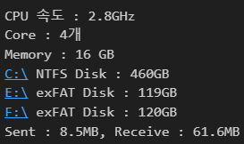
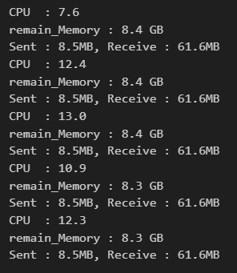

# Limpy_Project

coding practice in Python!

1. numberCatch (1/40)

  /numberCatch.JPG)

2. myComputersIP (2/40)

  

3. textToSpeech (3/40)

  
<audio controls>
    <source src='./3.textToSpeech/secondTTS.mp3'>
</audio>

4. QRCodeGenerate (4/40)

  

5. cpuCheck

  
    
